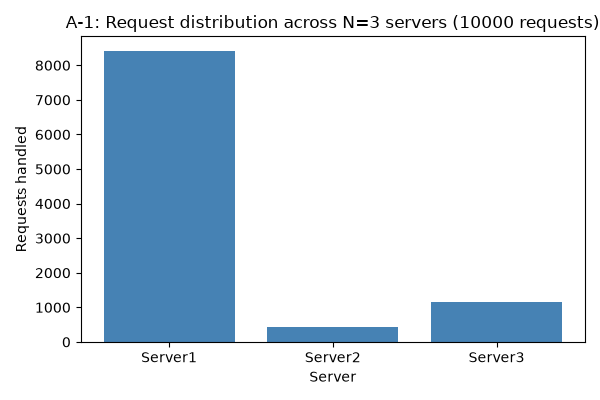
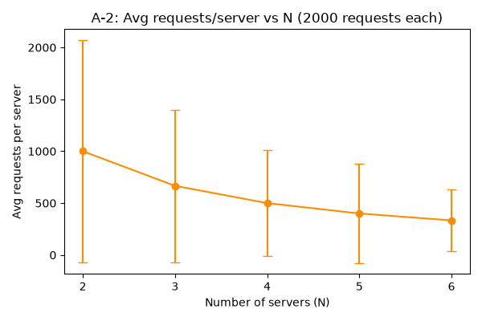
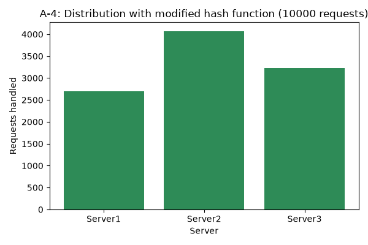

# MEMBERS
164643 - GITAU MUGURE TRACY  
166142 - NJIHIA MURANGA  
168971 -PHILLIP GAKUO  
166370 - NAOMI TEKO CHENANGAT

## Task 4: Testing & Analysis

All tests were run against the load balancer's live HTTP API (`/rep`, `/add`, `/rm`, `/<path>`) using a custom async Python client (`testing/client.py`, built with `aiohttp`) that fires concurrent requests and records which server handled each one. Full scripts and raw results are in `testing/`.

### A-1: Load distribution at N=3

10,000 concurrent requests were sent to the load balancer with the default N=3 servers running.

| Server | Requests | % |
|---|---|---|
| Server1 | 8,417 | 84.2% |
| Server2 | 438 | 4.4% |
| Server3 | 1,145 | 11.4% |

The distribution is far from even. This isn't a bug in the routing logic; it's a consequence of how few virtual nodes each server gets. With K=9 virtual replicas per server spread across only M=512 ring slots, and the ring's `get_server()` routing a request to the next occupied slot clockwise, each physical server effectively "owns" the entire gap between its virtual nodes and the previous occupied slot. With only 27 virtual nodes total on a 512-slot ring, those gaps can vary hugely by chance, and the specific formula given in the spec (`Φ(i,j) = i²+j²+2j+25 mod M`) happened to cluster Server1's virtual nodes right after a large empty stretch of the ring, giving it a disproportionate share of incoming request hashes.

### A-2: Scalability, N=2 to N=6

The same load test (2,000 requests per step) was repeated while scaling from N=2 to N=6 using the load balancer's own `/add`/`/rm` endpoints.

| N | Mean req/server | Std-dev |
|---|---|---|
| 2 | 1000.0 | 1069.1 |
| 3 | 666.7 | 735.0 |
| 4 | 500.0 | 511.5 |
| 5 | 400.0 | 476.5 |
| 6 | 333.3 | 297.1 |

Mean requests per server falls exactly as expected (total requests divided evenly by N), but the standard deviation stays large relative to the mean at every step. The imbalance from A-1 persists regardless of server count, and which specific server dominates changes each time N changes, since adding or removing a server reshuffles the whole ring (new numeric IDs, new virtual node placements). This confirms the skew is structural to the hash functions rather than a fixed quirk of one particular N.

One operational note: removing servers via `/rm` is noticeably slower than adding them, taking up to roughly 10 seconds per container, because the server's Flask process doesn't handle `SIGTERM`, so Docker waits its full default grace period before force-killing it during `docker stop`.

### A-3: Endpoint behavior and failure recovery

All documented endpoints and error cases were exercised directly:

- `GET /rep` correctly reports current N and replica list.
- `POST /add` valid requests scale up correctly; sending more hostnames than `n` correctly returns a 400 with `"<Error> Length of hostname list is more than newly added instances"`.
- `DELETE /rm` valid requests scale down correctly; the equivalent oversized-hostname-list case correctly returns a 400.
- `GET /<path>` a valid endpoint (`/home`) forwards correctly and returns the handling server's identity; an undefined endpoint (`/doesnotexist`) correctly returns a 400 with `"<Error> '/doesnotexist' endpoint does not exist in server replicas"`.

For failure recovery, one server container was killed directly with `docker kill`. The load balancer's heartbeat monitor (which polls every 5 seconds) detected the failure and spawned a replacement, restoring N to its original count in **9.9 seconds**, consistent with one heartbeat cycle plus the time to spin up a new container.

### A-4: Modified hash function

The original hash functions (`H(i) = i²+2i+17 mod M`, `Φ(i,j) = i²+j²+2j+25 mod M`) were temporarily replaced with a multiplicative hash (Knuth's method: `H(i) = i × 2654435761 mod M`, `Φ(i,j) = (i × 2654435761) XOR (j × 40503) mod M`), and the A-1 test was rerun at N=3.

| Server | Original hash | Modified hash |
|---|---|---|
| Server1 | 8,417 (84.2%) | 2,701 (27.0%) |
| Server2 | 438 (4.4%) | 4,070 (40.7%) |
| Server3 | 1,145 (11.4%) | 3,229 (32.3%) |
| **Std-dev** | **4,416.8** | **690.4** |

The modified hash produced a markedly more even distribution, roughly a 6x reduction in standard deviation. This supports the explanation given in A-1: the low-degree quadratic formulas in the original spec don't mix input bits thoroughly, causing virtual nodes to cluster on the ring, while a multiplicative hash spreads them far more uniformly. The original hash functions were restored after this test (see git history on `feature/testing-analysis`).
